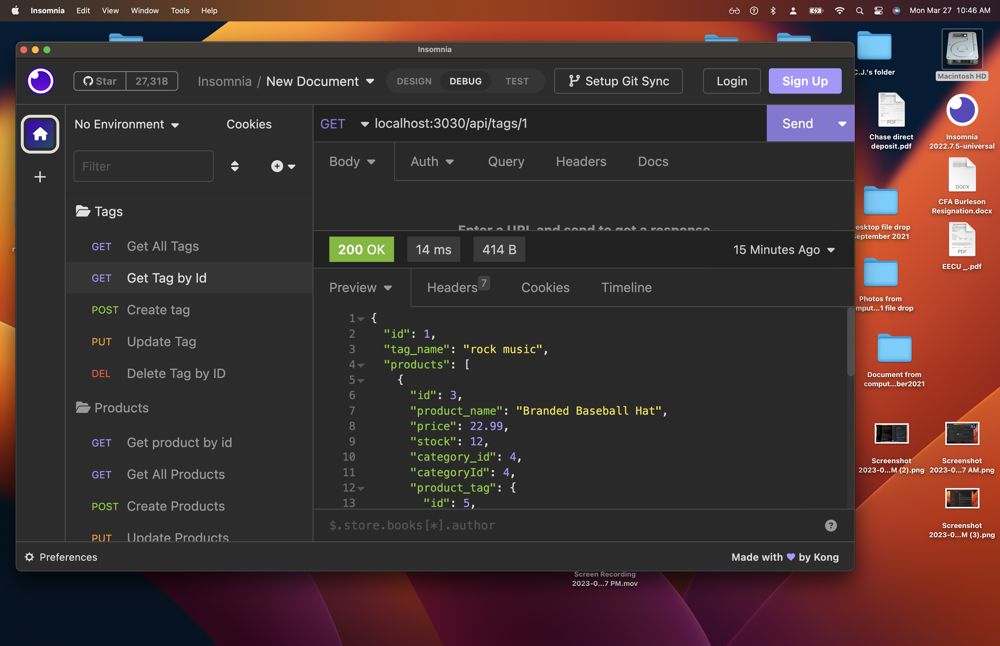
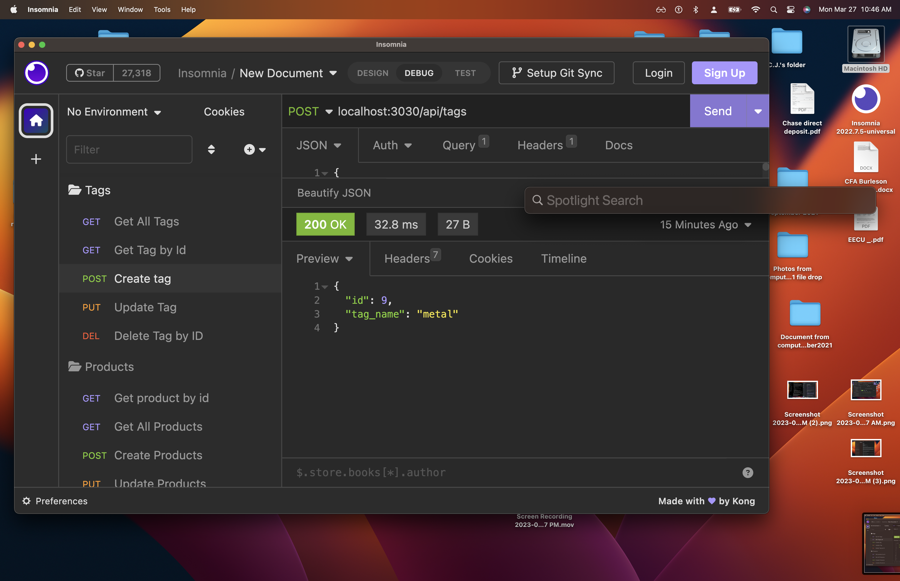
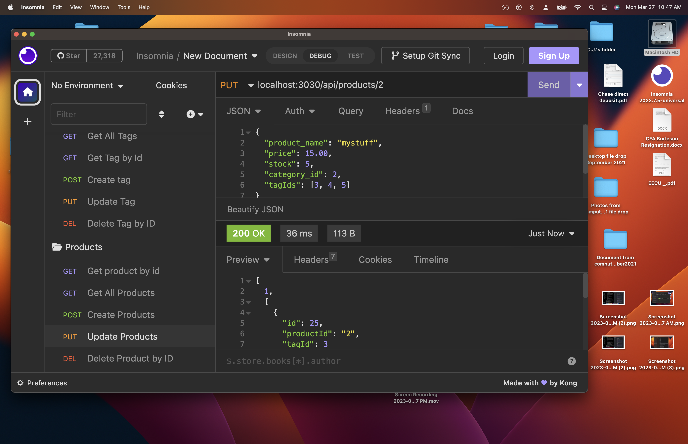
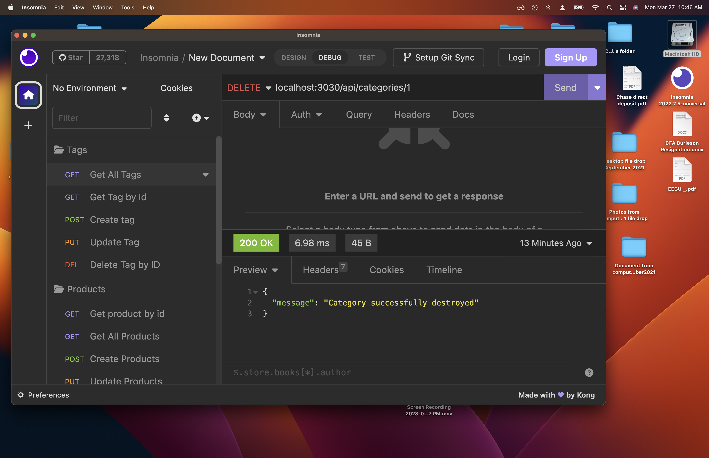

# 13 Object-Relational Mapping (ORM): E-Commerce Back End

## Description

I was wanting to create a back end  product database for an e-commerce site so that I would be able to update the listings quickly while also navigating the site effortlessly.  The biggest this that I learned is the relationships of the routes and the specificity required to be able to navigate correctly as well as the correct CRUD operations.

## Installation

To install this first clone the repo and using the example env file create env file with your creationals.  From there you need to make that the database is clear and ready for all that you are going to be inputting.  So run mysql -u root -p and input your password then source the schema.sql and quit.  From there you can seed the data base by inputing rpm run seed in the terminal.  Next open Insomnia to send json formatted data to view all data, view by id, create new data, update data or delete data.

## Usage

The following is a link to a video walktrhough of the application.

https://drive.google.com/file/d/1gSqpTuLqOeH73v8Uib5X2Fi9lb49Q1BA/view 

The following are some screenshots during various points of interaction within the application.

